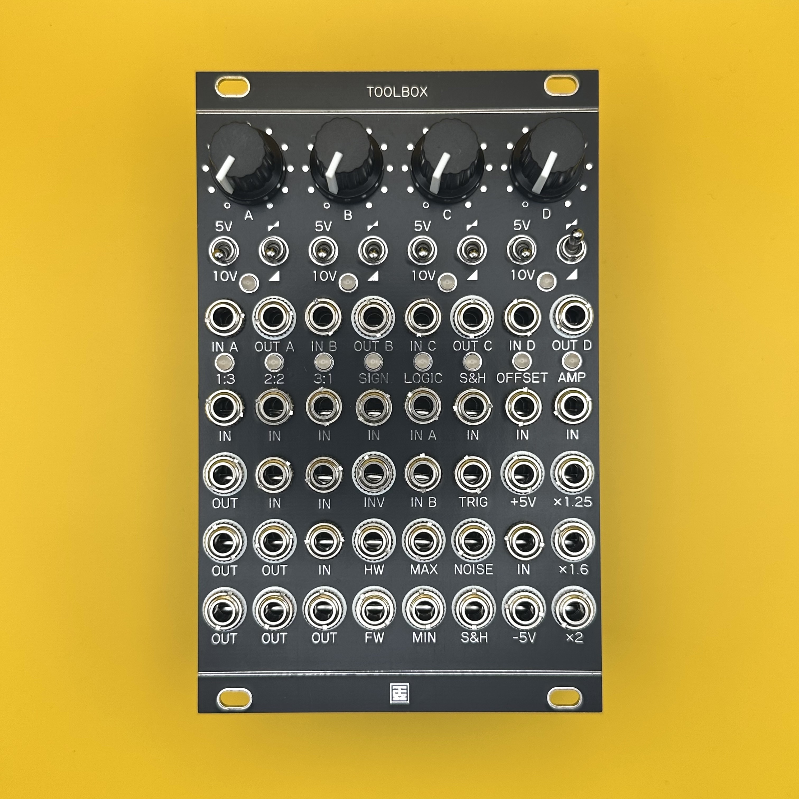

# Toolbox

## 概要 / Overview

**Toolbox** は、16HPサイズの中にモジュラーシンセに必要な多彩なユーティリティ機能を凝縮した多機能ツールボックスモジュールです。  
Mutable Instruments の「Shades」「Links」「Kinks」をベースにしつつ、独自の機能追加を行いました。

主な機能：
- オーディオ/CVミキサー（加算・減算）
- CVへのオフセット追加(5V/10V)・極性反転
- 1:3 バッファード・マルチプル
- 2:2 ユニティミキサー
- 3:1 アベレージミキサー（各チャンネルのゲイン = 1/3）
- SIGNセクション：インバーター / 半波整流 / 全波整流
- LOGICセクション：アナログOR / アナログAND
- S&Hセクション：サンプル＆ホールド / ホワイトノイズ出力
- OFFSET：±5V ↔ 0〜10Vの変換（5Vオフセット）
- AMP：CVやオーディオ信号の増幅  
  - 8V → 10V（x1.25）  
  - 5V → 8V（x1.6）  
  - 5V → 10V（x2）

**Toolbox** is a multifunction utility module that packs a wide range of essential modular synthesis tools into a compact 16HP format.  
It is based on Mutable Instruments' *Shades*, *Links*, and *Kinks*, with several added original features.

Key features include:
- Audio/CV mixer (for both addition and subtraction)
- Offset(5V/10V) and polarity inversion for CV signals
- 1:3 buffered multiple
- 2:2 unity mixer
- 3:1 averaging mixer (each channel gain = 1/3)
- SIGN section: inverter / half-wave rectifier / full-wave rectifier
- LOGIC section: analog OR / analog AND gates
- S&H section: sample & hold circuit / white noise output
- OFFSET: 5V offset converter for ±5V ↔ 0–10V signal conversion
- AMP: amplification of CV and audio signals  
  - 8V → 10V (x1.25)  
  - 5V → 8V (x1.6)  
  - 5V → 10V (x2)

## 仕様 / Spec
- Format: Eurorack
- Function: Multi tools
- Current needs: +12V: 160mA, -12V: 160mA
- Width: 16 HP
- Depth: 25mm (including power connector)

## 販売 / Sales

StudioKATオフィシャルショップで販売しています。(日本国内限定)  
https://www.studiokat.jp/items/106541624

## ライセンス / License

この作品は [Creative Commons 表示 - 継承 4.0 国際 (CC BY-SA 4.0)](https://creativecommons.org/licenses/by-sa/4.0/deed.ja) の下でライセンスされています。  
This work is licensed under the [Creative Commons Attribution-ShareAlike 4.0 International License](https://creativecommons.org/licenses/by-sa/4.0/).

## クレジット / Credits

- Designed by : StudioKAT
- Website : https://www.studiokat.jp/
- GitHub : https://github.com/StudioKAT
- X(Twitter) : https://x.com/StudioKAT_synth
- Instagram : https://www.instagram.com/studiokat_modular/

## 更新履歴 / Changelog

- `2025-05-28` v1.0 Released 