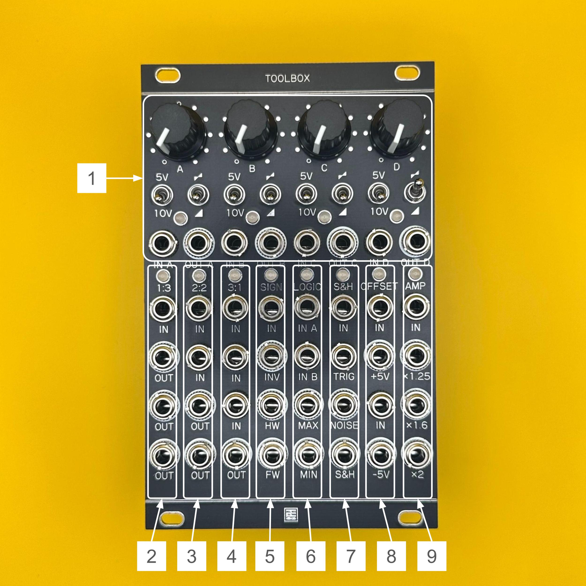

# Toolbox Manual (English)

## Overview

**Toolbox** is a multi-functional utility module packed into a 16HP Eurorack format.  
Inspired by Mutable Instruments' "Shades", "Links", and "Kinks", this module adds original functionality and extends utility capabilities for both audio and CV.

### Key Features:
- Audio/CV mixer (sum/subtract)  
- CV offset generator (+5V/+10V), polarity inversion  
- 1:3 buffered multiple  
- 2:2 unity mixer  
- 3:1 average mixer (each input gain = 1/3)  
- SIGN section: inverter / half-wave rectifier / full-wave rectifier  
- LOGIC section: analog OR / analog AND  
- S&H section: sample & hold / white noise generator  
- OFFSET section: ±5V ↔ 0–10V converter (±5V shift)  
- AMP section: CV or audio gain boost for envelope scaling

---

## Specifications

- **Format**: Eurorack  
- **Width**: 16 HP  
- **Depth**: 25 mm  
- **Power Consumption**: +12V: 160mA / -12V: 160mA  

> **IMPORTANT**: Connect the ribbon cable with the red stripe aligned to -12V.  
> Incorrect connection can permanently damage the module.  
> **Always check cable orientation before powering on.**

---

## Functional Sections

1. **Attenuator / Offset / Mixer**  
   4-channel audio/CV mixer and attenuator section.  
   Normalized to +5V or +10V when no input is patched (switchable).  
   Each channel can be switched between attenuator and attenuverter modes.  
   Outputs are internally daisy-chained.

2. **1:3**  
   1 input, 3 output buffered multiple.

3. **2:2**  
   Unity gain mixer: two inputs are summed and distributed to two outputs.

4. **3:1**  
   3-input average mixer with 1/3 gain per channel—ideal for mixing hot oscillator signals to prevent clipping.

5. **SIGN**  
   Signal inverter and wave rectification section.  
   Provides half-wave and full-wave rectification, including 0V clipping and phase inversion of negative voltages.

6. **LOGIC**  
   Outputs the maximum (analog OR) and minimum (analog AND) of two input voltages.

7. **S&H**  
   When a trigger is received at TRIG IN, the voltage at IN is sampled and held at the output.  
   Internally normalized to white noise for random voltage generation.  
   The NOISE OUT provides continuous white noise independent from the S&H output.

8. **OFFSET**  
   Top: adds +5V to the input signal  
   Bottom: subtracts 5V from the input signal  
   Useful for converting ±5V pitch signals to 0–10V (e.g., Moog).

9. **AMP**  
   Amplifies CV or audio signals to scale envelope voltages.  
   Preset gain ratios:  
   - 8V → 10V (×1.25)  
   - 5V → 8V (×1.6)  
   - 5V → 10V (×2)

---

> All LEDs light up **green** for positive output and **red** for negative output.

---

## License

This work is licensed under a [Creative Commons Attribution-ShareAlike 4.0 International License (CC BY-SA 4.0)](https://creativecommons.org/licenses/by-sa/4.0/).

---

## Credits

- **Designed by**: StudioKAT  
- **Website**: [https://www.studiokat.jp/](https://www.studiokat.jp/)  
- **GitHub**: [https://github.com/StudioKAT](https://github.com/StudioKAT)  
- **X (Twitter)**: [https://x.com/StudioKAT_synth](https://x.com/StudioKAT_synth)  
- **Instagram**: [https://www.instagram.com/studiokat_modular/](https://www.instagram.com/studiokat_modular/)

---

## Changelog

- `2025-05-28`: v1.0 Released  
