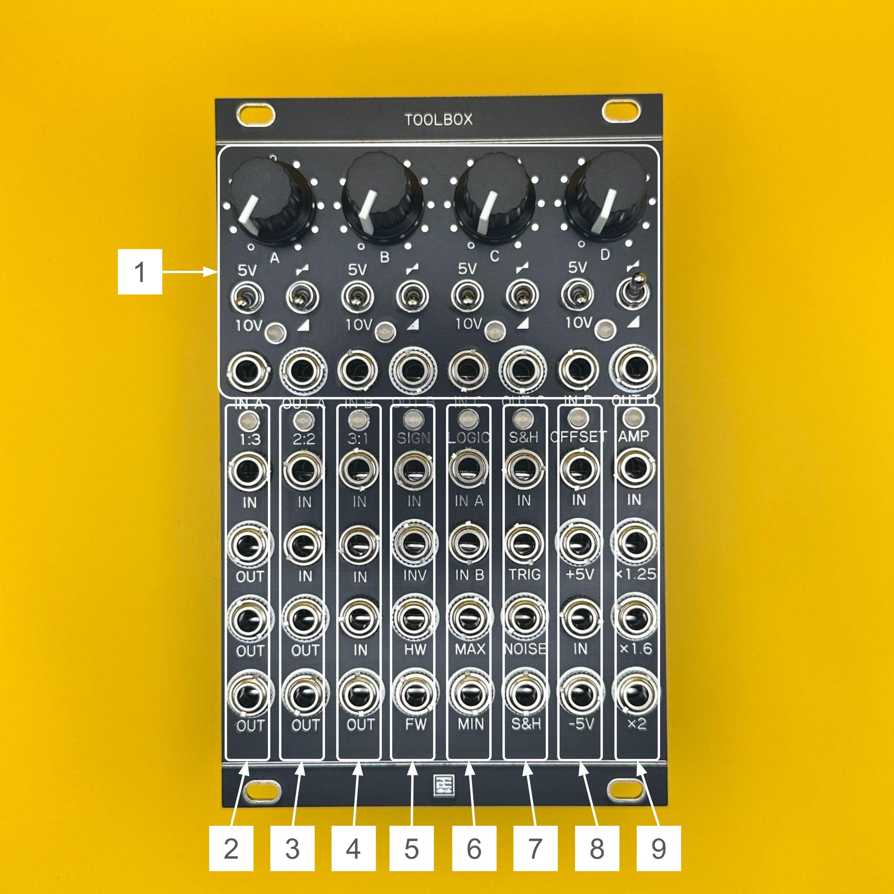

# Toolbox マニュアル（日本語）

## 概要

**Toolbox** は、16HPの中にモジュラーシンセに必要な多彩なユーティリティ機能を凝縮した多機能ツールボックスモジュールです。  
Mutable Instruments の「Shades」「Links」「Kinks」をベースに、独自の機能追加が施されています。

### 主な機能：
- オーディオ／CVミキサー（加算・減算）  
- CVへのオフセット追加（5V／10V）、極性反転  
- 1:3 バッファード・マルチプル  
- 2:2 ユニティミキサー  
- 3:1 アベレージミキサー（各チャンネルのゲイン = 1/3）  
- SIGNセクション：インバーター／半波整流／全波整流  
- LOGICセクション：アナログOR／アナログAND  
- S&Hセクション：サンプル＆ホールド／ホワイトノイズ出力  
- OFFSET：±5V ↔ 0〜10V 変換（5Vオフセット）  
- AMP：CVやオーディオ信号の電圧拡張

---

## 仕様

- **フォーマット**：Eurorack  
- **幅**：16 HP  
- **奥行き**：25 mm  
- **消費電流**：+12V: 160mA / -12V: 160mA  

> ※ ケーブルの赤いラインが -12V に接続されていることを確認してください。  
> 誤接続するとモジュールが故障する可能性があります。  
> **電源投入前にケーブルの向きを必ずご確認ください。**

---

## 各部の機能

1. **Attenuator / Offset / Mixer**  
   4チャンネルのCV／オーディオ信号を処理できるミキサー・アッテネーターです。  
   未接続時には+5Vまたは+10Vがノーマライズされ、固定電圧出力として使用可能。切替スイッチ付き。  
   スイッチでアッテネーター／アッテヌバーターの切替も可能。  
   出力は内部的にデイジーチェーン接続されています。

2. **1:3**  
   バッファー付きの1入力3出力マルチプルです。

3. **2:2**  
   2入力の加算結果を2つのアウトへ出力するユニティゲインミキサーです。

4. **3:1**  
   各入力のゲインを1/3に設定した3入力ミキサーです。  
   オシレーターなど、クリッピングしやすい信号のミキシングに適しています。

5. **SIGN**  
   信号インバーターと半波／全波整流器のセクションです。  
   信号を0Vでクリップ、もしくは負電圧成分を反転する処理を行います。

6. **LOGIC**  
   入力された2信号の最大値（アナログOR）および最小値（アナログAND）を出力します。

7. **S&H**  
   トリガー信号が入力されるたびにINの電圧をサンプルし、保持して出力します。  
   INには内部的にホワイトノイズがノーマライズされています。  
   NOISE OUTはS&Hとは独立したノイズ出力として使用できます。

8. **OFFSET**  
   上段：入力信号に+5Vを加算  
   下段：入力信号から5Vを減算  
   Moogの±5Vピッチ信号を0～10Vへ変換するなどの用途に便利です。

9. **AMP**  
   CVまたはオーディオ信号を一定倍率で増幅します。  
   エンベロープ電圧変換に最適な倍率設定：  
   - 8V → 10V（×1.25）  
   - 5V → 8V（×1.6）  
   - 5V → 10V（×2）

---

> すべてのLEDは、出力がプラスの場合は緑、マイナスの場合は赤に点灯します。

---

## ライセンス

この作品は [Creative Commons 表示 - 継承 4.0 国際 (CC BY-SA 4.0)](https://creativecommons.org/licenses/by-sa/4.0/deed.ja) の下でライセンスされています。

---

## クレジット

- **Designed by**：StudioKAT  
- **Website**：[https://www.studiokat.jp/](https://www.studiokat.jp/)  
- **GitHub**：[https://github.com/StudioKAT](https://github.com/StudioKAT)  
- **X（旧Twitter）**：[https://x.com/StudioKAT_synth](https://x.com/StudioKAT_synth)  
- **Instagram**：[https://www.instagram.com/studiokat_modular/](https://www.instagram.com/studiokat_modular/)

---

## 更新履歴

- `2025-05-28`：v1.0 リリース  
